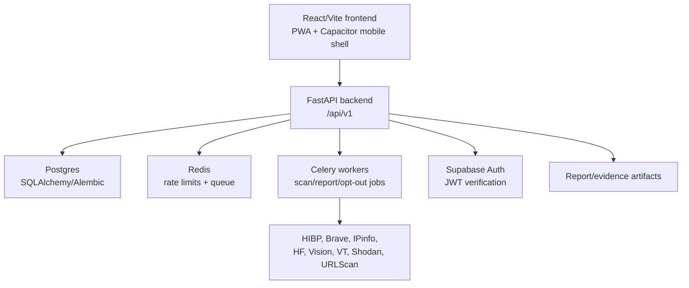

# Claude Continuation Handoff — Vindica

Updated: 2026-07-25

## Copy/Paste Prompt For Claude

Use this prompt to start the next Claude session:

```text
You are taking over the Vindica repo. Please read this handoff first:

docs/CLAUDE_CONTINUATION_HANDOFF_2026-07-25.md

Then read these supporting docs:

- docs/VINDICA_MASTER_ROADMAP_2026.md
- docs/VINDICA_SERVERLESS_MIGRATION_PLAN.md
- docs/PRODUCTION_READINESS.md
- docs/PROVIDER_KEYS.md
- docs/MOBILE_APP_RUNBOOK.md
- docs/DESKTOP_APP_RUNBOOK.md
- docs/LIVE_DEPLOY_RUNBOOK.md

Your next challenge is to move Vindica toward a serverless, production-operable product without breaking the existing web/mobile/PWA app.

Start by auditing the current codebase, then implement the first safe serverless readiness slice:

1. Add serverless environment examples for frontend and backend.
2. Add a serverless smoke-test script.
3. Ensure the backend can clearly report external database/Redis/provider readiness through /ready.
4. Preserve all existing Docker/VPS behavior.
5. Do not commit secrets or provider keys.
6. Do not touch unrelated untracked files unless explicitly asked.

Before editing, inspect git status and current branch. After editing, run the most relevant build/tests, commit, and push the branch if credentials allow.
```

## Current Repository

- Repository: `nyakanne/theclipart`
- Active branch: `codex/vindica-hardening-and-audit`
- Current head at last Codex handoff: `e70930a`
- Latest pushed commits:
  - `e70930a Add serverless migration plan`
  - `b79f4af Add Vindica master roadmap`
  - `adc4f70 Make Vindica installable as desktop app`
  - `6b09307 Add VPS rescue console script`
  - `4b62775 Polish mobile app parity navigation`
  - `bbcf44f Add Capacitor mobile app scaffold`

## Important Workspace Warning

There is an unrelated untracked file:

```text
backend/dev_ip_lookup_app.py
```

Do not modify, delete, stage, commit, or rely on it unless the user explicitly asks.

## What Vindica Is Now

Vindica is a privacy-defense product:

- scan personal identifiers
- show exposure/breach/web/OSINT evidence in-app
- save scan results to a protected vault
- support broker opt-out and report workflows
- run as web app, desktop-installable PWA, and Capacitor iOS/Android shell

The product is not merely a breach checker. The intended positioning is:

> A personal data exposure command center: scan yourself, see where your data appears, save evidence, remove what can be removed, and monitor for re-exposure.

## Current Architecture



## Current Serverless Direction

Preferred near-term migration:

1. Frontend on Vercel or equivalent static/CDN hosting.
2. Auth on Supabase.
3. Database on Supabase Postgres or Neon.
4. Redis/rate limits on Upstash Redis.
5. Backend on Cloud Run first, preserving FastAPI.
6. Async jobs on Cloud Tasks, Pub/Sub, QStash, or later Vercel Queues.
7. Reports/evidence files in object storage.
8. Retire the Hetzner VPS only after serverless smoke tests pass.

This is intentionally a hybrid serverless path. A full Vercel Functions rewrite is possible later but is not the fastest safe route.

## What Was Recently Built

### Mobile App Scaffold

Files include:

- `frontend/capacitor.config.ts`
- `frontend/ios/`
- `frontend/android/`
- `frontend/.env.mobile.example`
- `docs/MOBILE_APP_RUNBOOK.md`

Scripts:

```json
"mobile:build": "tsc && node scripts/vite.mjs build --mode mobile",
"mobile:sync": "npm run mobile:build && cap sync",
"mobile:ios": "npm run mobile:sync && cap open ios",
"mobile:android": "npm run mobile:sync && cap open android"
```

Mobile mode points the API at:

```text
https://vindica.me/api/v1
```

unless `VITE_API_BASE_URL` overrides it.

### Desktop App / PWA

Files include:

- `frontend/public/manifest.webmanifest`
- `frontend/public/sw.js`
- `frontend/public/offline.html`
- `frontend/public/shield.svg`
- `frontend/public/icon-1024.png`
- `frontend/src/components/Layout/AppInstallButton.tsx`
- `frontend/src/pwa.ts`
- `docs/DESKTOP_APP_RUNBOOK.md`

Scripts:

```json
"desktop:build": "npm run build",
"desktop:package": "npm run desktop:build && mkdir -p ../dist-desktop && tar -czf ../dist-desktop/vindica-desktop-pwa.tar.gz -C dist ."
```

Desktop bundle path after packaging:

```text
dist-desktop/vindica-desktop-pwa.tar.gz
```

`dist-desktop/` is ignored by git.

### Roadmaps

Added:

- `docs/VINDICA_MASTER_ROADMAP_2026.md`
- `docs/VINDICA_SERVERLESS_MIGRATION_PLAN.md`

These are the best strategic context docs for the next agent.

## Local Launch Notes

Frontend:

```bash
cd frontend
npm run dev
```

The wrapper usually prints:

```text
http://localhost:3000/
```

or another port if `3000` is occupied.

Demo backend without Docker/Postgres/Redis:

```bash
cd backend
/usr/bin/env \
  APP_ENV=development \
  DEMO_MODE=true \
  PUBLIC_APP_URL=http://localhost:3000 \
  CORS_ORIGINS='["http://localhost:3000","http://127.0.0.1:3000"]' \
  ALLOWED_HOSTS='["localhost","127.0.0.1"]' \
  .venv312/bin/python -m uvicorn app.main:app --host 127.0.0.1 --port 8000
```

Health:

```bash
curl -i http://localhost:8000/health
curl -i http://localhost:8000/ready
```

Demo scan:

```bash
curl -i -X POST http://localhost:3000/api/v1/scans \
  -H 'Content-Type: application/json' \
  --data '{"email":"test@example.com"}'
```

Note: in demo mode, results are demo/local and not real provider-backed results.

## Production Reality

The live VPS/Hetzner path has been unreliable. Previous symptoms:

- `vindica.me` returned 502 or timed out.
- SSH to `5.78.72.84` timed out or refused.
- DNS/network behavior was inconsistent.
- The app build itself was not the only issue; host/network/server access was the blocker.

Do not assume live deploy is healthy. Verify before claiming success:

```bash
curl -i https://vindica.me/health
curl -i https://vindica.me/ready
curl -I https://vindica.me/
curl -I https://vindica.me/lookup
curl -I https://vindica.me/osint
```

If live VPS is still used, follow:

```text
docs/LIVE_DEPLOY_RUNBOOK.md
scripts/server-rescue-console.sh
```

But the strategic direction is serverless migration to reduce VPS fragility.

## Provider Keys And Secrets

Never commit or echo secrets.

Server-only provider keys:

- `BRAVE_SEARCH_API_KEY` or `BRAVE_API_KEY`
- `HIBP_API_KEY`
- `IPINFO_TOKEN`
- `HF_TOKEN` or `HUGGINGFACE_API_KEY`
- `VIRUSTOTAL_API_KEY`
- `SHODAN_API_KEY`
- Azure/Google Vision keys if used

Frontend-safe env vars:

- `VITE_SUPABASE_URL`
- `VITE_SUPABASE_PUBLISHABLE_KEY`
- `VITE_API_BASE_URL`

Provider keys belong only in backend/platform secrets, not frontend env.

## Important Product Requirements

The user has repeatedly emphasized:

- real in-app results, not external links as the main workflow
- saved scans in logged-in user vault
- dashboard/history that actually populates
- privacy notice, terms, consent
- zero-trust/user isolation: no one can access anyone else’s data
- cost controls for paid provider APIs
- mobile and desktop app operability
- production readiness, not just demo UI
- a roadmap/pitch that makes the product credible

## Next Challenge: Serverless Readiness Slice

Recommended first implementation slice:

### 1. Add serverless env examples

Create:

```text
frontend/.env.serverless.example
backend/.env.serverless.example
```

Include:

- frontend API URL
- Supabase frontend keys
- external Postgres URL placeholders
- external Redis URL placeholders
- provider key placeholders
- object storage placeholders
- email provider placeholders
- production safety flags

Do not include real keys.

### 2. Add serverless smoke test

Create:

```text
scripts/serverless-smoke-test.sh
```

It should accept a base URL and test:

- `/health`
- `/ready`
- frontend root if same-origin
- `/api/v1/lookups/username/github` or equivalent endpoint
- provider readiness output without exposing secrets

It should fail clearly and print actionable output.

### 3. Keep Docker behavior intact

Do not delete:

- `docker-compose.yml`
- `backend/Dockerfile`
- worker services
- VPS runbooks

The migration is additive until serverless passes.

### 4. Improve readiness if needed

If `/ready` does not clearly distinguish:

- database connected
- queue/rate-limit connected
- auth configured
- provider capabilities
- object storage configured
- email configured

then add fields carefully.

### 5. Verify

Run:

```bash
cd frontend
npm run build
cd ..
backend/.venv312/bin/python -m compileall -q backend/app
git diff --check
```

If tests exist and are safe:

```bash
cd backend
.venv312/bin/python -m pytest
```

## Acceptance Criteria For The Next Agent

The next Claude session should finish with:

- clear code/doc changes for serverless readiness
- no committed secrets
- existing Docker/VPS path preserved
- build/compile checks run
- a new commit on `codex/vindica-hardening-and-audit`
- push attempted or completed
- explicit list of what remains blocked by external accounts/platform setup

## Files To Read First

Read these before changing code:

```text
docs/VINDICA_SERVERLESS_MIGRATION_PLAN.md
docs/VINDICA_MASTER_ROADMAP_2026.md
docs/PRODUCTION_READINESS.md
docs/PROVIDER_KEYS.md
docs/LIVE_DEPLOY_RUNBOOK.md
frontend/src/services/api.ts
backend/app/core/config.py
backend/app/main.py
docker-compose.yml
```

## Quick Mental Model

Vindica should move from:

```text
VPS + nginx + Docker Compose + Postgres container + Redis container + Celery container
```

to:

```text
Static app + managed auth + managed Postgres + managed Redis + managed serverless backend + managed queue/jobs + managed object storage
```

without breaking the current app shell.

