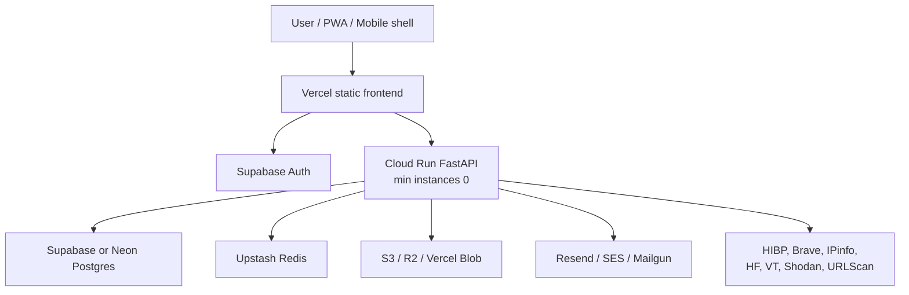

# Vindica Serverless Free-Tier Runbook

Updated: 2026-07-25

This runbook moves Vindica away from the fragile always-on VPS model and toward managed services that can idle cheaply or scale to zero.

The goal is not magic zero cost forever. The goal is:

- no nginx box to babysit
- no Docker Compose host holding production together
- no always-on app server charge
- provider keys kept server-side
- hard quotas and readiness checks before public launch

## Target Shape



## What Is Ready In This Branch

- `vercel.json` builds `frontend/` and serves `frontend/dist` as a static SPA.
- `backend/Dockerfile` honors Cloud Run's `PORT` env var while still defaulting to `8000` locally.
- `docker-compose.yml` can point at managed Redis through `REDIS_URL` while keeping local Redis as the default.
- `deploy/cloud-run/backend-service.yaml` is a scale-to-zero backend service template.
- `backend/.env.serverless.example` lists server-only managed runtime settings.
- `frontend/.env.serverless.example` lists browser-safe frontend settings.
- `scripts/serverless-smoke-test.sh` checks frontend routes plus API `/health` and `/ready`.
- `scripts/serverless-proof.sh` proves the current repo is still buildable and serverless-shaped.

## Setup Order

1. Create Supabase project for Auth.
2. Use Supabase Postgres or Neon Postgres for the production database.
3. Run Alembic migrations against the managed Postgres URL.
4. Create Upstash Redis and copy the TLS Redis URL into backend secrets.
5. Create object storage for reports and evidence artifacts.
6. Create a transactional email provider key, preferably Resend for the first pass.
7. Add provider keys as backend secrets only.
8. Deploy frontend to Vercel.
9. Deploy backend to Cloud Run.
10. Run `scripts/serverless-smoke-test.sh`.

## Frontend Deployment

Use the root project with Vercel. The checked-in `vercel.json` already tells Vercel:

- install from `frontend`
- build with `npm run build`
- serve `frontend/dist`
- rewrite all app routes to `/index.html`

Set these Vercel env vars:

```text
VITE_API_BASE_URL=https://api.vindica.me/api/v1
VITE_SUPABASE_URL=https://YOUR_PROJECT_REF.supabase.co
VITE_SUPABASE_PUBLISHABLE_KEY=YOUR_SUPABASE_PUBLISHABLE_KEY
```

Do not set HIBP, Brave, IPinfo, Shodan, VirusTotal, or HF keys in Vercel frontend env.

## Backend Deployment

Cloud Run is the lowest-rewrite backend target because Vindica already has a FastAPI container.

Use `deploy/cloud-run/backend-service.yaml` as the template. Replace:

```text
REGION
PROJECT_ID
```

with your actual Google Cloud project values, then load every `secretKeyRef` name from Secret Manager.

The backend must have:

```text
APP_ENV=production
SERVERLESS_PLATFORM=cloud-run
REQUIRE_AUTH=true
DATABASE_URL=postgresql+asyncpg://...
SYNC_DATABASE_URL=postgresql://...
REDIS_URL=rediss://...
OBJECT_STORAGE_BACKEND=s3 or r2 or vercel_blob
KMS_KEY_ID=...
```

`/ready` should return `status: ready` before public traffic is cut over.

## Smoke Test

After both frontend and backend are deployed:

```bash
scripts/serverless-smoke-test.sh https://vindica.me https://api.vindica.me
```

If testing before all production blockers are filled:

```bash
ALLOW_BLOCKED_READY=1 scripts/serverless-smoke-test.sh https://vindica.me https://api.vindica.me
```

Blocked readiness is acceptable during migration, but not for launch.

## Cost Controls

Keep these low at first:

```text
MAX_ACTIVE_SCANS_PER_USER=2
SCANS_PER_DAY=10
EXPENSIVE_LOOKUPS_PER_HOUR=30
IMAGE_ANALYSES_PER_DAY=10
MAX_REMOTE_IMAGE_BYTES=5242880
MAX_REQUEST_BODY_BYTES=10485760
```

Also keep Cloud Run max scale low until real traffic is understood:

```yaml
autoscaling.knative.dev/maxScale: "3"
```

Raise these only after logs show normal usage.

## Cutover Rule

Do not point `vindica.me` away from the VPS until all of this passes:

```bash
scripts/serverless-proof.sh
scripts/serverless-smoke-test.sh https://NEW_FRONTEND_URL https://NEW_API_URL
```

Then move DNS:

- `vindica.me` and `www.vindica.me` to the static frontend platform.
- `api.vindica.me` to Cloud Run.

Keep the VPS as rollback only until the serverless stack survives a full scan, dashboard load, account login, privacy/terms view, and provider readiness test.
