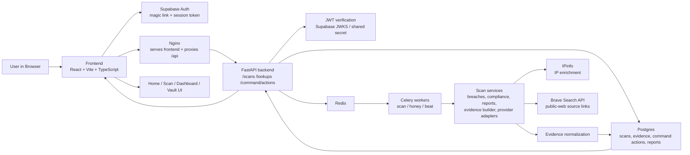
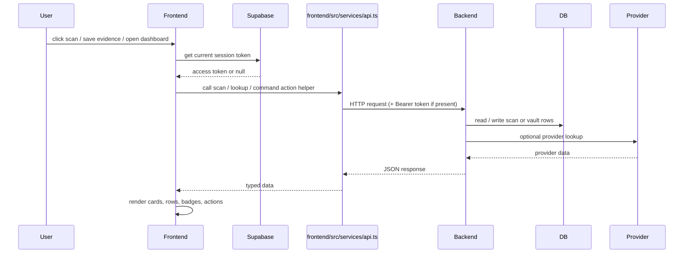
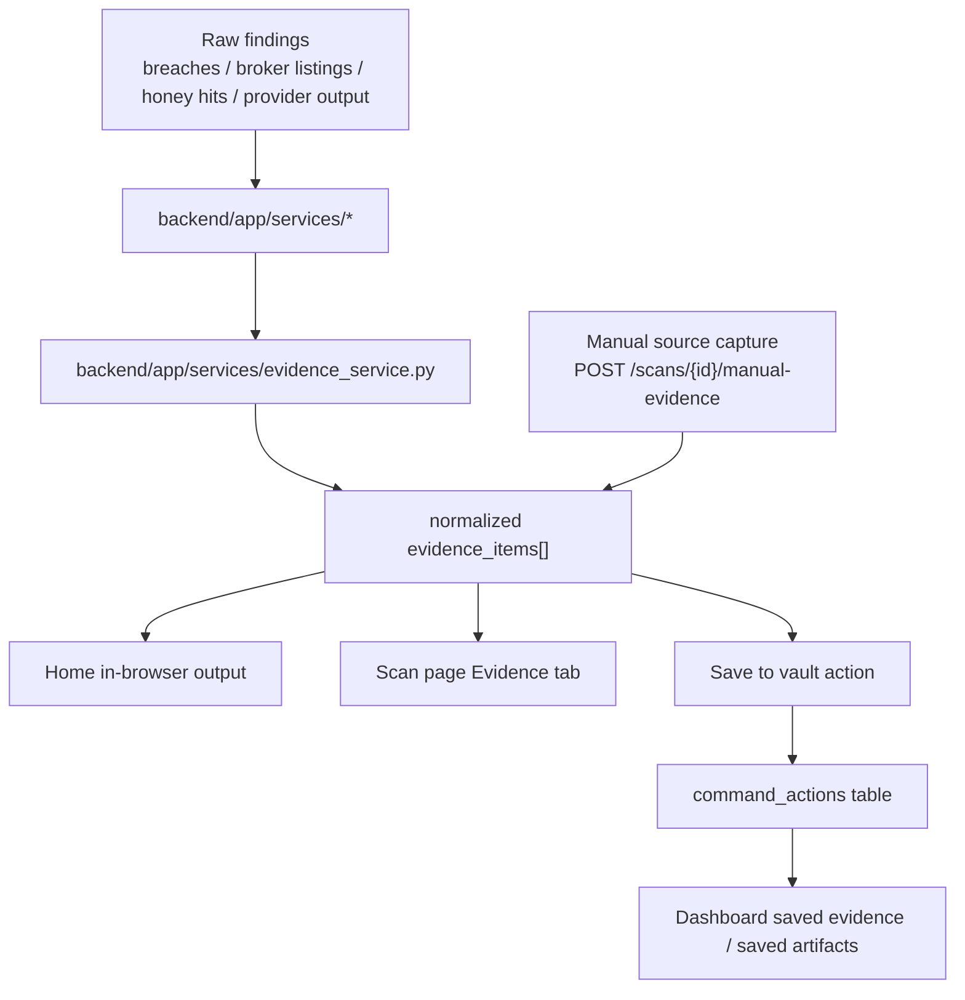

# Vindica Stack, Calls, and Presentation

This document explains how data moves through Vindica, which services own which responsibilities, and how backend results become visible evidence in the browser.

## Stack map

## Responsibilities by layer

- `frontend/`
  - captures user input
  - reads Supabase session state
  - calls backend routes through a shared API client
  - renders explicit evidence rows, scan pages, and vault history

- `backend/app/api/v1/`
  - owns public API routes
  - validates auth and ownership
  - creates scan jobs and returns scan results

- `backend/app/services/`
  - provider adapters and domain logic
  - evidence normalization
  - report generation

- `backend/app/workers/`
  - asynchronous execution for scans and long-running tasks

- `Postgres`
  - scan records
  - breach rows
  - broker listings
  - honey token hits
  - command actions / saved vault artifacts

- `Supabase`
  - email magic-link auth
  - browser session token

## Call path: browser to backend

## Main frontend call sites

### Shared API client

- [frontend/src/services/api.ts](/Users/anneshirleynyako/Documents/Codex/2026-04-27/https-github-com-nyakanne-theclipart-git/frontend/src/services/api.ts)
- [frontend/src/services/supabase.ts](/Users/anneshirleynyako/Documents/Codex/2026-04-27/https-github-com-nyakanne-theclipart-git/frontend/src/services/supabase.ts)

The API client:

- uses `/api/v1` as the base URL
- injects `Authorization: Bearer <token>` when a Supabase session exists
- converts backend errors into user-facing `Error(message)` values

### Scan calls

- `POST /scans`
- `GET /scans/{id}/status`
- `GET /scans/{id}`

Frontend entry points:

- [frontend/src/hooks/useScan.ts](/Users/anneshirleynyako/Documents/Codex/2026-04-27/https-github-com-nyakanne-theclipart-git/frontend/src/hooks/useScan.ts)
- [frontend/src/pages/Home.tsx](/Users/anneshirleynyako/Documents/Codex/2026-04-27/https-github-com-nyakanne-theclipart-git/frontend/src/pages/Home.tsx)
- [frontend/src/components/Investigation/ExposureLookupPanel.tsx](/Users/anneshirleynyako/Documents/Codex/2026-04-27/https-github-com-nyakanne-theclipart-git/frontend/src/components/Investigation/ExposureLookupPanel.tsx)
- [frontend/src/pages/ScanPage.tsx](/Users/anneshirleynyako/Documents/Codex/2026-04-27/https-github-com-nyakanne-theclipart-git/frontend/src/pages/ScanPage.tsx)

Backend route:

- [backend/app/api/v1/scans.py](/Users/anneshirleynyako/Documents/Codex/2026-04-27/https-github-com-nyakanne-theclipart-git/backend/app/api/v1/scans.py)

### Lookup calls

- `GET /lookups/ip/{value}`

Frontend entry point:

- [frontend/src/components/Investigation/ExposureLookupPanel.tsx](/Users/anneshirleynyako/Documents/Codex/2026-04-27/https-github-com-nyakanne-theclipart-git/frontend/src/components/Investigation/ExposureLookupPanel.tsx)

Backend route:

- [backend/app/api/v1/lookups.py](/Users/anneshirleynyako/Documents/Codex/2026-04-27/https-github-com-nyakanne-theclipart-git/backend/app/api/v1/lookups.py)

Provider adapter:

- [backend/app/services/ipinfo_service.py](/Users/anneshirleynyako/Documents/Codex/2026-04-27/https-github-com-nyakanne-theclipart-git/backend/app/services/ipinfo_service.py)

### Provider-backed evidence enrichment

Scan result enrichment now also runs through:

- [backend/app/services/provider_evidence_service.py](/Users/anneshirleynyako/Documents/Codex/2026-04-27/https-github-com-nyakanne-theclipart-git/backend/app/services/provider_evidence_service.py)
- [backend/app/services/search_evidence_service.py](/Users/anneshirleynyako/Documents/Codex/2026-04-27/https-github-com-nyakanne-theclipart-git/backend/app/services/search_evidence_service.py)

These services:

- keep provider credentials in backend-only config
- call IPinfo for IP enrichment
- call Brave Search for public-web source pages tied to names, usernames, phones, and emails
- normalize the returned links/snippets into the same `evidence_items[]` feed used by scan pages, browser output, and report generation
- emit provider status rows when a provider is unavailable, fails, or returns no match so the frontend can offer a manual evidence-capture fallback

### Manual evidence capture fallback

When providers miss or fail, operators can still preserve explicit sources through:

- `POST /scans/{scan_id}/manual-evidence`

Backend service:

- [backend/app/services/manual_evidence_service.py](/Users/anneshirleynyako/Documents/Codex/2026-04-27/https-github-com-nyakanne-theclipart-git/backend/app/services/manual_evidence_service.py)

Frontend entry points:

- [frontend/src/components/Investigation/EvidencePanel.tsx](/Users/anneshirleynyako/Documents/Codex/2026-04-27/https-github-com-nyakanne-theclipart-git/frontend/src/components/Investigation/EvidencePanel.tsx)

This fallback path:

- stores a scan-scoped manual source capture in persistent vault storage
- merges that source back into `evidence_items[]`
- keeps the same result visible in the scan page, browser output, dashboard, and generated report

### Save-to-vault calls

- `GET /command/actions`
- `POST /command/actions`
- `PATCH /command/actions/{id}`

Frontend entry points:

- [frontend/src/components/Investigation/EvidencePanel.tsx](/Users/anneshirleynyako/Documents/Codex/2026-04-27/https-github-com-nyakanne-theclipart-git/frontend/src/components/Investigation/EvidencePanel.tsx)
- [frontend/src/pages/Dashboard.tsx](/Users/anneshirleynyako/Documents/Codex/2026-04-27/https-github-com-nyakanne-theclipart-git/frontend/src/pages/Dashboard.tsx)

Backend route:

- [backend/app/api/v1/command_actions.py](/Users/anneshirleynyako/Documents/Codex/2026-04-27/https-github-com-nyakanne-theclipart-git/backend/app/api/v1/command_actions.py)

## How scan data becomes browser evidence

### Evidence item shape

Vindica normalizes evidence into a consistent shape so the same item can be:

- rendered in-browser
- opened on the scan page
- saved to the vault
- shown on the dashboard
- included in generated reports

Important fields:

- `title`
- `source_name`
- `source_category`
- `source_url`
- `detail`
- `risk_level`
- `confidence`
- `captured_at`
- `exposed_fields`
- `action_label`

See:

- [backend/app/schemas/scan.py](/Users/anneshirleynyako/Documents/Codex/2026-04-27/https-github-com-nyakanne-theclipart-git/backend/app/schemas/scan.py)
- [frontend/src/types/index.ts](/Users/anneshirleynyako/Documents/Codex/2026-04-27/https-github-com-nyakanne-theclipart-git/frontend/src/types/index.ts)

## Presentation surfaces

### Home page

- [frontend/src/pages/Home.tsx](/Users/anneshirleynyako/Documents/Codex/2026-04-27/https-github-com-nyakanne-theclipart-git/frontend/src/pages/Home.tsx)
- [frontend/src/pages/home/utils.ts](/Users/anneshirleynyako/Documents/Codex/2026-04-27/https-github-com-nyakanne-theclipart-git/frontend/src/pages/home/utils.ts)

The home page:

- polls live scan status and result
- converts `evidence_items` into browser-readable rows
- shows source, explicit finding, severity, and next action

### Scan page

- [frontend/src/pages/ScanPage.tsx](/Users/anneshirleynyako/Documents/Codex/2026-04-27/https-github-com-nyakanne-theclipart-git/frontend/src/pages/ScanPage.tsx)
- [frontend/src/components/Investigation/EvidencePanel.tsx](/Users/anneshirleynyako/Documents/Codex/2026-04-27/https-github-com-nyakanne-theclipart-git/frontend/src/components/Investigation/EvidencePanel.tsx)

The scan page:

- loads the full scan result
- shows all `evidence_items`
- allows open-source or open-provider actions
- allows save-to-vault when authenticated

### Dashboard

- [frontend/src/pages/Dashboard.tsx](/Users/anneshirleynyako/Documents/Codex/2026-04-27/https-github-com-nyakanne-theclipart-git/frontend/src/pages/Dashboard.tsx)

The dashboard:

- loads saved scans
- loads saved evidence items
- loads saved non-evidence vault artifacts
- acts as the retained account-scoped memory surface

## Current real provider-backed path

Right now the strongest fully wired provider-backed path is IP evidence:

1. user submits an IP
2. backend calls IPinfo
3. backend normalizes result into `evidence_items`
4. frontend renders:
   - title
   - provider name
   - detail summary
   - captured time
   - provider record link
5. user can save it to the vault

## What to extend next

The same pipeline should be reused for:

- HIBP email breach evidence
- Brave Search URL/snippet evidence
- Google CSE curated broker/public-record evidence
- Twilio or Telesign phone enrichment
- reverse-image evidence providers

The design goal is not “more widgets.” It is one evidence pipeline with multiple providers feeding the same normalized result shape.
