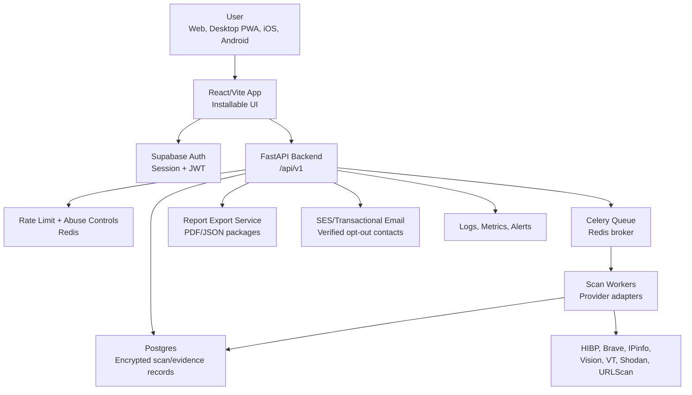

# Vindica Master Roadmap

Updated: 2026-07-10

## Executive Summary

Vindica is a privacy-defense product that helps people discover exposed personal data, understand the evidence, save it in a protected vault, and take action through opt-out, reporting, monitoring, and evidence packaging workflows.

The product should be positioned as:

> **A personal data exposure command center: scan yourself, see where your data appears, save evidence, remove what can be removed, and monitor for re-exposure.**

Vindica is not just a breach checker. The strongest product angle is the combination of:

- **Exposure discovery:** email, name, phone, username, IP, domain, image, public web evidence.
- **In-app evidence:** source URLs, timestamps, provider snapshots, risk explanation, scan history.
- **Protected vault:** user-owned scan history, consent records, reports, opt-out actions.
- **Action layer:** broker opt-outs, DSAR/report packets, platform reporting, monitoring.
- **Trust layer:** privacy-first storage, explicit consent, user isolation, rate limits, auditability.
- **Multi-platform access:** web app, installable desktop PWA, iOS/Android Capacitor app shell.

## North Star

Vindica wins when a non-technical person can answer:

1. **Where is my data exposed?**
2. **How serious is it?**
3. **What proof do I have?**
4. **What can I remove now?**
5. **What changed since last time?**
6. **Can I trust this app with sensitive personal information?**

The product roadmap must protect that promise before adding broad feature volume.

## Product Pillars

| Pillar | Product Promise | Core Features | Success Signal |
|---|---|---|---|
| Discover | Find real exposure across useful sources. | Scan, lookup, OSINT, image/domain tools, provider evidence. | Users see actionable results or clear provider-unavailable states. |
| Explain | Turn raw findings into understandable risk. | Risk score, exposed data classes, severity, provider notes, timelines. | Users know what matters first. |
| Preserve | Save evidence safely and privately. | Vault, screenshots/manual evidence, reports, chain-of-custody metadata. | Users can return to prior scans and export proof. |
| Act | Help users remove or report exposure. | Broker opt-out queue, DSAR emails, platform reports, authority packets. | Users complete removal actions inside the product. |
| Monitor | Watch for re-exposure and drift. | Scheduled scans, alerts, domain/image watchlists, broker re-checks. | Users come back because Vindica keeps protecting them. |
| Trust | Make privacy and security visible. | Consent, terms, data minimization, deletion, auth, encryption, rate limits. | Users believe the product is safer than manual searching. |

## Current State

### Built

- React/Vite frontend with Home, Lookup, OSINT, Dashboard, Account, Privacy, Terms, internal status, and product shell.
- Installable desktop PWA app shell with manifest, service worker, offline page, and install button.
- Capacitor iOS and Android app scaffolds with synced web assets.
- FastAPI backend with scan routes, lookup routes, readiness checks, and provider capability reporting.
- Celery/Redis/Postgres architecture for production scan execution.
- Provider integrations and setup paths for HIBP, Brave, IPinfo, URLScan/RDAP, VirusTotal, Shodan, Hugging Face, Azure/Google Vision.
- Consent notice, legal pages, account/vault UX, and production readiness documentation.
- Docker Compose production shape for backend, frontend, workers, Redis, Postgres, and supporting services.

### Not Yet Production-Ready

- Live `vindica.me` availability is blocked by VPS/DNS/network/server access issues.
- Production auth must be fully verified against Supabase and protected route behavior.
- User data isolation needs end-to-end tests for scans, actions, reports, evidence, opt-outs, and dashboard history.
- Real provider keys must be configured server-side only.
- Production Postgres migrations and Redis availability must be validated.
- Mobile native builds need Apple/Android signing, store metadata, and device QA.
- Stripe/billing is not implemented.
- Monitoring/alerts are planned but not complete.

## Roadmap Overview

```mermaid
flowchart LR
  P0["0. Foundation Repair\nLive access, env, deploy"] --> P1["1. Trustworthy MVP\nAuth, vault, real results"]
  P1 --> P2["2. Evidence Product\nReports, exports, timelines"]
  P2 --> P3["3. Removal Engine\nOpt-out, DSAR, broker queue"]
  P3 --> P4["4. Mobile + Desktop\nInstall, native polish, device QA"]
  P4 --> P5["5. Monetization\nPlans, billing, quotas"]
  P5 --> P6["6. Monitoring\nAlerts, recurring scans"]
  P6 --> P7["7. Compliance + Scale\nAudit, SOC2 prep, B2B API"]
  P7 --> P8["8. Launch Engine\nGrowth, partnerships, support"]
```

## Phase 0: Foundation Repair

**Goal:** Make the app reachable, buildable, deployable, and testable every time.

### Product Deliverables

- Public web app loads reliably at `https://vindica.me`.
- App shell install works on desktop from HTTPS.
- Mobile web layout works across core flows.
- Every unavailable provider has an honest in-app explanation.

### Technical Deliverables

- Restore VPS or move hosting to a more reliable platform.
- Verify DNS A/AAAA records and SSL renewal.
- Confirm nginx preserves `/api` when proxying to FastAPI.
- Confirm `/health` and `/ready` report useful status.
- Build deploy artifact from clean source.
- Add one command for local demo mode and one command for production smoke.

### Security Deliverables

- No secrets in source, chat, browser, frontend env, or logs.
- Server `.env` has production-only provider keys.
- Production refuses weak default secrets and default database passwords.
- Firewall allows only required inbound ports: `22`, `80`, `443`.

### Marketing Deliverables

- One landing headline:
  - **Find where your personal data is exposed. Remove what you can. Monitor what comes back.**
- One demo script showing scan, evidence, vault, and opt-out intent.
- One waitlist/contact CTA if billing is not live.

### Readiness Gate

- `https://vindica.me/health` returns `{"status":"ok"}`.
- `https://vindica.me/ready` has no production blockers.
- `/`, `/lookup`, `/osint`, `/dashboard`, `/account`, `/privacy`, `/terms` load.
- One demo scan returns structured results.

## Phase 1: Trustworthy MVP

**Goal:** Make Vindica safe enough for real users to create accounts and save scans.

### Product Deliverables

- Sign up/sign in flow is clear.
- Users can run a scan and save it to their vault.
- Dashboard shows saved scan history and result summaries.
- Account page shows consent, privacy controls, and deletion option.
- Results windows show provider status, evidence, and what action is possible.

### Technical Deliverables

- Supabase frontend envs configured:
  - `VITE_SUPABASE_URL`
  - `VITE_SUPABASE_PUBLISHABLE_KEY`
- Backend auth configured:
  - `SUPABASE_URL`
  - `SUPABASE_JWKS_URL` or valid legacy JWT secret
  - `REQUIRE_AUTH=true` in production
- Attach bearer tokens from frontend API client.
- Store signed-in scans with `user_id`.
- Add test coverage for:
  - user A cannot read user B scans
  - user A cannot read user B command actions
  - user A cannot read user B reports
  - anonymous public lookup behavior is explicit

### Security Deliverables

- User data isolation tests become release-blocking.
- Add audit fields: created by, created at, last accessed if practical.
- Encrypt sensitive payloads at rest.
- Support self-service deletion for scans and linked evidence.

### Marketing Deliverables

- Explain the vault simply:
  - **Your exposure history, evidence, and removal actions in one protected workspace.**
- Create a trust page section:
  - no selling personal data
  - user-initiated scans
  - deletion controls
  - provider key boundaries

### Readiness Gate

- A signed-in user creates a scan and sees `vault_saved: true`.
- A second test user cannot access it.
- Dashboard shows that saved scan after refresh.
- Logout and login preserve correct account-scoped data.

## Phase 2: Real Results Engine

**Goal:** Make the app produce meaningful in-app results from core providers without sending users away.

### Product Deliverables

- Email scan:
  - HIBP breaches and data classes.
  - Public web evidence from Brave where configured.
  - Clear no-breach state.
- Name/phone/username lookup:
  - Brave source links.
  - Username platform checks.
  - Phone metadata from libphonenumber.
- Domain/IP:
  - RDAP, URLScan, VirusTotal/Shodan if configured.
  - IPinfo when configured.
- Image:
  - Hugging Face, Azure, or Google Vision outputs.
  - Reverse image evidence path.

### Technical Deliverables

- Server-only provider keys:
  - `BRAVE_SEARCH_API_KEY`
  - `HIBP_API_KEY`
  - `IPINFO_TOKEN`
  - `HF_TOKEN`
  - `VIRUSTOTAL_API_KEY`
  - `SHODAN_API_KEY`
- Provider status object returned with every scan.
- Cache or dedupe expensive provider calls.
- Rate-limit expensive endpoints.
- Keep partial results when one provider fails.

### Security Deliverables

- No provider keys in frontend bundles.
- Cost caps per user and per IP.
- Do not fetch private-network image URLs.
- Timeouts, max payload sizes, redirect limits, and content-type validation.

### Marketing Deliverables

- Use honest language:
  - **Vindica checks configured privacy, breach, web, and threat-intelligence sources. Results vary by provider availability and legal access.**
- Publish “sources we check” page grouped by category.

### Readiness Gate

- `/ready` reports configured providers.
- Scan result includes provider status for success, no-match, unavailable, and failed cases.
- UI never says “not found” when the real condition is “provider unavailable.”

## Phase 3: Evidence Product

**Goal:** Make results useful for action, not just interesting.

### Product Deliverables

- Evidence timeline per scan.
- Source URL, provider name, timestamp, evidence type, and confidence.
- Manual evidence upload or capture.
- PDF/JSON evidence export.
- Report packet for platform, employer, law enforcement, or legal advisor use.

### Technical Deliverables

- Normalize evidence schema across providers.
- Add chain-of-custody style metadata:
  - evidence ID
  - hash
  - captured timestamp
  - source URL
  - account owner
- Export service for PDF/JSON.
- Store exports by user with access checks.

### Security Deliverables

- Hash exported reports.
- Redact sensitive values where possible.
- Expiring signed URLs for downloads.
- Audit report generation and deletion.

### Marketing Deliverables

- Position:
  - **Not just search results. An evidence packet you can actually use.**
- Create sample anonymized report screenshots for demos.

### Readiness Gate

- A completed scan can generate a report.
- Report only opens for its owner.
- Evidence survives refresh and appears in dashboard.

## Phase 4: Removal And Opt-Out Engine

**Goal:** Turn findings into user action.

### Product Deliverables

- Broker list with removal status.
- Bulk opt-out queue.
- Verified broker contact database.
- DSAR/removal email templates.
- Manual fallback link when email contact is unavailable.
- Status tracking: not started, queued, sent, responded, blocked, completed.

### Technical Deliverables

- Verified broker contact source of truth.
- SES or other transactional email provider.
- Queue jobs for sending and tracking.
- Idempotent opt-out sends.
- User review/confirm step before sending.

### Security Deliverables

- No guessed privacy emails.
- Log provider action without exposing PII in logs.
- Rate-limit email sending.
- Store consent record for every opt-out batch.

### Marketing Deliverables

- Offer:
  - **One guided workflow to start removing your information from data brokers.**
- Avoid overpromising guaranteed deletion.

### Readiness Gate

- User can send at least one verified opt-out email.
- User can export a record of requests sent.
- App clearly distinguishes verified email removal from manual portal links.

## Phase 5: Mobile And Desktop App

**Goal:** Make Vindica feel like a real cross-platform privacy tool.

### Product Deliverables

- Installable desktop app via PWA.
- iOS app shell opens core flows.
- Android app shell opens core flows.
- Mobile bottom navigation works across scan, lookup, OSINT, dashboard, account.
- Offline page explains that live scans need network access.

### Technical Deliverables

- Capacitor iOS build signed with Apple Developer account.
- Capacitor Android build signed with Play Console key.
- `VITE_API_BASE_URL=https://vindica.me/api/v1` for native mobile builds.
- Device QA on:
  - iPhone small/large
  - iPad if supported
  - Android phone small/large
  - desktop PWA Chrome/Edge/Safari Add to Dock
- App icons, splash screens, status bar styling, safe-area coverage.

### Security Deliverables

- Mobile never embeds provider secrets.
- API tokens use secure auth flow.
- Sensitive local cache is minimized.
- Logout clears local session state.

### Marketing Deliverables

- App store one-liner:
  - **Your personal data exposure command center.**
- Screenshots:
  - Scan
  - Results
  - Evidence
  - Opt-out
  - Dashboard

### Readiness Gate

- Desktop install succeeds from HTTPS.
- iOS simulator and one physical iPhone run the app.
- Android emulator and one physical Android run the app.
- Auth, scan, result, dashboard, privacy/terms all pass on devices.

## Phase 6: Monetization

**Goal:** Turn the product into a sustainable business without creating unsafe incentives.

### Plan Structure

| Plan | Audience | Features |
|---|---|---|
| Free | Trust-building entry point | Limited scans, limited lookups, basic breach check, basic broker list. |
| Personal Pro | Individuals | Saved vault, deeper provider evidence, monitoring, exports, opt-out queue. |
| Family | Households | Multiple profiles, household dashboard, shared billing. |
| Professional | Journalists, creators, advocates | Evidence packets, platform reports, monitoring, priority provider depth. |
| Business / Forensics | Teams and ELF-style workflows | Organization accounts, API, case exports, audit logs, higher limits. |

### Technical Deliverables

- Stripe checkout.
- Stripe billing portal.
- Webhook-driven entitlement sync.
- Plan-based quotas.
- Graceful plan downgrade behavior.
- Provider-cost budget controls.

### Security Deliverables

- Billing webhooks verified.
- Entitlements enforced backend-side.
- Never trust frontend-only plan state.
- Abuse controls for free tier.

### Marketing Deliverables

- Pricing page.
- Feature comparison.
- Founder/beta offer.
- Conversion path from scan result to paid vault/monitoring.

### Readiness Gate

- Paid checkout grants entitlement.
- Cancel/downgrade updates entitlement.
- Free user cannot bypass premium limits by changing frontend state.

## Phase 7: Monitoring And Alerts

**Goal:** Make Vindica useful after the first scan.

### Product Deliverables

- Recurring scans.
- New breach alerts.
- Broker reappearance alerts.
- Domain/image watchlist alerts.
- Weekly or monthly digest.

### Technical Deliverables

- Scheduled Celery tasks.
- Alert preferences.
- Email notification service.
- Scan diff engine.
- Alert dedupe.

### Security Deliverables

- Notification emails avoid sensitive details.
- User can disable monitoring and delete watchlists.
- Clear retention periods.

### Marketing Deliverables

- Message:
  - **Privacy is not one scan. Vindica keeps watching.**
- Retention and notification transparency.

### Readiness Gate

- Scheduled scan produces a diff.
- User receives safe alert.
- User can stop monitoring.

## Phase 8: Compliance, Trust, And Security Hardening

**Goal:** Make Vindica defensible as a privacy/security product.

### Technical Deliverables

- Threat model.
- Security test suite.
- CI production proof script.
- Dependency scanning.
- Secrets scanning.
- Backup and restore drill.
- Incident response runbook.
- Observability dashboard.

### Compliance Deliverables

- GDPR/CCPA privacy review.
- Data retention policy.
- Subprocessor list.
- DPA-ready posture for business customers.
- Consent versioning.
- Deletion and export procedures.

### Security Deliverables

- Third-party penetration test.
- Rate limit and abuse audit.
- Access control audit.
- Secure logging audit.
- KMS envelope encryption in production.
- Signed report exports if needed.

### Marketing Deliverables

- Trust center.
- Security overview.
- Responsible disclosure page.
- Privacy policy summary in plain English.

### Readiness Gate

- Security review produces no unresolved critical/high findings.
- Production has monitoring, backups, tested restore, and documented incident process.

## Phase 9: B2B And API

**Goal:** Expand beyond consumer self-service into professional workflows.

### Product Deliverables

- Organization accounts.
- Team roles.
- Case folders.
- API keys.
- Webhooks for scan complete/report generated.
- Forensics-grade export packages.

### Technical Deliverables

- Organization model.
- Role-based access control.
- API key lifecycle.
- Per-org quotas.
- Webhook signing.
- Audit log export.

### Security Deliverables

- Org-level isolation tests.
- API key hashing.
- Key rotation.
- Least-privilege roles.

### Marketing Deliverables

- B2B landing page.
- ELF Forensics / professional positioning.
- Pilot program.
- Partner pitch deck.

### Readiness Gate

- Organization owner can invite member.
- Member permissions are enforced backend-side.
- API key scan cannot access another org.

## Phase 10: Launch And Growth

**Goal:** Make launch measurable, repeatable, and supportable.

### Product Launch Assets

- Public landing page.
- Demo video.
- Product screenshots.
- Pricing page.
- Docs/help center.
- Support intake.
- Trust page.
- Changelog.

### Marketing Roadmap

| Stage | Goal | Channels | Assets |
|---|---|---|---|
| Private beta | Validate product and trust. | Personal network, privacy communities, targeted testers. | Founder demo, feedback form, onboarding checklist. |
| Public beta | Build credibility and case studies. | LinkedIn, TikTok/short video, Reddit where appropriate, newsletters. | Case study, sample report, comparison page. |
| Paid launch | Convert high-intent users. | SEO, creator partnerships, data broker content, breach-response content. | Pricing, guarantees/limits, trust center. |
| Partner launch | Reach professional users. | Attorneys, advocates, journalists, cybersecurity consultants. | Partner deck, API one-pager, evidence packet sample. |

### Core Messaging

- **For individuals:** “Find your exposed data and start taking it back.”
- **For creators/public figures:** “Monitor impersonation, leaks, and broker exposure.”
- **For families:** “Protect household privacy from brokers and breaches.”
- **For professionals:** “Create structured evidence packets from exposure investigations.”
- **For businesses/forensics:** “Run privacy exposure workflows with auditability and controls.”

### SEO Content Pillars

- “How to remove yourself from data brokers”
- “What to do after a data breach”
- “How to find where your phone number is exposed”
- “How to monitor personal information online”
- “Privacy tools for creators and public figures”
- “Evidence packet for online harassment or impersonation”

### Launch Metrics

| Funnel Area | Metric |
|---|---|
| Acquisition | Visitors, signups, install rate, source channel. |
| Activation | First scan completed, first result viewed, provider result rate. |
| Retention | Saved vault scans, return scans, monitoring enabled. |
| Revenue | Trial conversion, paid conversion, churn, ARPU. |
| Trust | Deletion requests completed, support response time, security incidents. |
| Cost | Provider spend per active user, failed provider rate, cache hit rate. |

## Technical Architecture Target

## Presentation Narrative

### 10-Slide Product Deck

1. **Title:** Vindica, personal data exposure command center.
2. **Problem:** People do not know where their data is exposed, what matters, or how to act.
3. **Why Now:** Breaches, broker exposure, impersonation, harassment, AI scraping, rising privacy regulation.
4. **Product:** Scan, evidence, vault, opt-out, monitor.
5. **Demo Flow:** Input, results, evidence, save, opt-out, dashboard.
6. **Differentiation:** Not a single-source breach checker; action and evidence workflow.
7. **Trust:** Consent, data isolation, encrypted storage, provider transparency, deletion.
8. **Business Model:** Free, Pro, Family, Professional, Business/API.
9. **Roadmap:** MVP to monitoring to B2B.
10. **Ask:** Beta users, provider keys/live deploy, legal review, funding/partnerships.

### Technical Advisor Deck

1. Architecture overview.
2. Auth/data isolation.
3. Provider integration pattern.
4. Queue and rate-limit design.
5. Evidence model.
6. Deployment model.
7. Security risks and mitigations.
8. Testing plan.
9. Observability and incident response.
10. Next engineering milestones.

### Customer Demo Flow

1. Start on Vindica home.
2. Accept privacy/terms consent.
3. Create account/vault.
4. Run scan with one identifier.
5. Show result categories.
6. Open evidence details.
7. Save to vault.
8. Start opt-out queue.
9. Open dashboard.
10. Explain monitoring.

## Immediate 30-Day Plan

### Week 1

- Restore live server access or migrate hosting.
- Configure production env safely.
- Verify Supabase auth and vault save.
- Run production smoke tests.

### Week 2

- Fix result states and dashboard saved history.
- Add ownership tests for all user-owned resources.
- Validate provider keys and `/ready` capability reporting.
- Polish mobile layouts for core flows.

### Week 3

- Finish evidence timeline and report export MVP.
- Build broker opt-out queue with verified contacts only.
- Create sample report and screenshots.
- Prepare beta onboarding.

### Week 4

- Add Stripe waitlist or paid beta checkout.
- Run security review checklist.
- Launch private beta.
- Collect feedback and measure activation.

## 90-Day Plan

### Days 1-30: Stabilize

- Live deployment reliable.
- Auth and data isolation proven.
- Core providers configured.
- Demo scan and vault flow stable.

### Days 31-60: Productize

- Evidence export MVP.
- Opt-out queue MVP.
- Dashboard/history polish.
- Mobile install/device QA.

### Days 61-90: Monetize

- Stripe subscriptions.
- Monitoring MVP.
- Trust center.
- Public beta launch assets.
- Early partner/customer outreach.

## Release Gates

| Gate | Must Be True |
|---|---|
| Local demo | Frontend and demo backend run locally; demo scan completes. |
| Live web | `vindica.me` loads; `/health` ok; `/ready` no blockers. |
| Vault beta | Auth works; scans save; user isolation tests pass. |
| Provider beta | HIBP, Brave, IPinfo, and one image provider configured. |
| Evidence beta | Evidence and report exports work for saved scans. |
| Paid beta | Stripe entitlements enforced backend-side. |
| Mobile beta | iOS/Android builds pass physical-device smoke tests. |
| Public launch | Security review, privacy/legal review, support process, monitoring, backups. |

## Risks And Mitigations

| Risk | Why It Matters | Mitigation |
|---|---|---|
| Users expect guaranteed deletion. | Privacy removal is not guaranteed by every broker. | Use clear “request submitted” and “manual required” statuses. |
| Provider APIs fail or cost too much. | Results and margins suffer. | Cache, quotas, provider status, fallback states, billing alerts. |
| Sensitive data exposure. | Product trust depends on privacy. | Auth, encryption, data minimization, deletion, logging discipline. |
| App looks like a tool collection. | Users need one coherent workflow. | Command center flow: scan, evidence, save, act, monitor. |
| Live server instability. | No product if users cannot reach it. | Harden deploy or move to managed infrastructure. |
| Legal/compliance ambiguity. | Privacy product handles sensitive data. | Counsel review, retention policy, subprocessors, consent records. |

## Definition Of Production-Ready

Vindica is production-ready only when:

- The app is reachable over HTTPS.
- Users can create accounts and save scans.
- No user can access another user’s vault data.
- Provider keys are server-side only.
- Expensive providers are rate-limited.
- Results are honest about source status.
- Users can delete saved data.
- Privacy, terms, consent, and retention behavior are implemented.
- Logs do not leak PII.
- Backups and restore are tested.
- Monitoring alerts the operator before users report outages.
- A real end-to-end scan works on web, desktop PWA, and mobile app shell.

