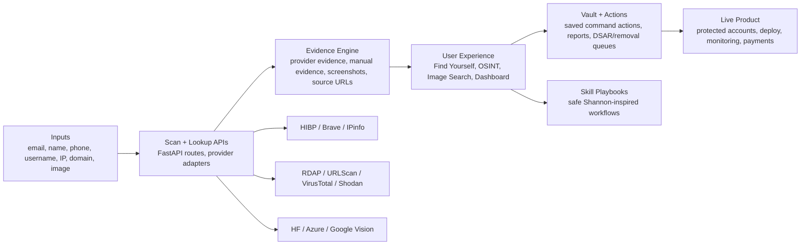
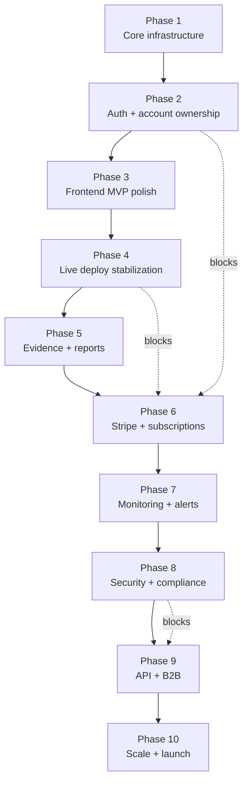
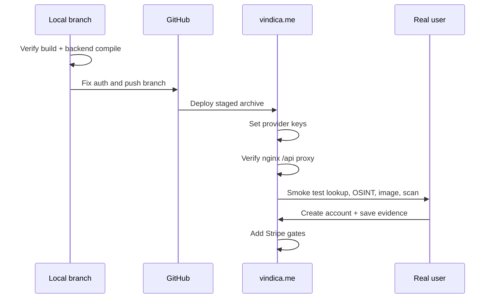

# Vindica Product + Phase Map

Updated: 2026-05-23

## Current Position

Vindica is no longer a backend-only Phase 1 project. The current branch is best described as:

**Late Phase 2 / early Phase 3: product shell exists, in-app OSINT/evidence workflows exist, live deployment and auth hardening are the next gates.**

The product has crossed the bridge from infrastructure into a usable frontend, but it is not yet a revenue-ready, hardened production SaaS.

## Product Map



## Accurate Phase Map

| Phase | Name | Current Status | What It Means |
|---|---|---:|---|
| 1 | Core Infrastructure | Complete / operational locally | Backend routes, schemas, workers, provider pattern, health checks, Docker shape, scan lifecycle. |
| 2 | Identity + Access Layer | In progress | Supabase session client exists, backend JWT guard exists, but route protection and ownership tests need hardening. |
| 3 | Frontend MVP | In progress / partially built | Home, scan, lookup, OSINT, image search, dashboard, account, Phase 1 status, and playbooks exist. Needs polish and live verification. |
| 4 | Live Deployment | Blocked by deploy/auth hygiene | Server has run before, but latest branch is local-only until GitHub auth/deploy is fixed. Needs safe redeploy path. |
| 5 | Evidence Productization | In progress | Evidence panels, command actions, provider outputs, manual capture, reports. Needs final export/chain-of-custody polish. |
| 6 | Monetization | Not started | Stripe plans, limits, checkout, billing portal, paid feature gates. |
| 7 | Monitoring + Alerts | Planned | Recurring scans, drift alerts, broker re-checks, image/domain watchlists, notification delivery. |
| 8 | Security + Compliance | Planned / partial | RLS/auth baseline started. Needs threat model, rate limits, audit logs, privacy policy flow, pen test, abuse controls. |
| 9 | API + B2B / ELF Forensics | Future | Public API keys, partner dashboards, case exports, organization accounts, forensic workflows. |
| 10 | Scale + Launch | Future | Observability, cost controls, support ops, onboarding, GTM, production runbooks. |

## Phase Dependencies



## What Is Built Now

### Backend

- FastAPI app with `/health`.
- Scan lifecycle routes.
- Lookup routes for username, IP, phone, domain, domain intel, and image.
- Provider service pattern for HIBP, Brave-style evidence, IPinfo, image providers, VirusTotal, Shodan, and URLScan-style enrichment.
- Celery worker shape and scan progress updates.
- Evidence schemas and persistence-oriented response models.
- Command actions for saving workflow output.

### Frontend

- Product home and scan entry.
- Find Yourself / lookup workflow.
- OSINT Tools workspace.
- Image search / reverse-image panel.
- Evidence panel.
- Dashboard/account surfaces.
- Internal Phase 1 status page.
- Auth session hook and account flow.
- Shannon-inspired OSINT Skill Playbooks as safe in-app workflow checklists.

### Ops / Docs

- Provider setup docs.
- Deployment and error-history docs.
- Phase 1 status artifact.
- Shannon skill files stored under `.claude/skills/shannon`.

## What Is Not Done Yet

### Immediate Blockers

1. **Push latest branch to GitHub**
   - Local commits exist.
   - Push is blocked because GitHub auth is not configured in this workspace.

2. **Safe live redeploy**
   - Stage archive first.
   - Verify `frontend/`, `backend/`, `docker-compose.yml`.
   - Rebuild `frontend`, `backend`, workers, beat.
   - Smoke test `/health`, `/osint`, `/lookup`, and one provider-backed lookup.

3. **Production API proxy correctness**
   - Host nginx must preserve `/api` prefix.
   - Correct pattern:

```nginx
location /api/ {
  proxy_pass http://127.0.0.1:8000;
}
```

4. **Provider keys**
   - Required for useful live evidence:
     - `BRAVE_API_KEY` or `BRAVE_SEARCH_API_KEY`
     - `HIBP_API_KEY`
   - Strongly useful:
     - `HF_TOKEN`
     - `VIRUSTOTAL_API_KEY`
     - `SHODAN_API_KEY`
     - Azure or Google Vision keys.

### Product Gaps

- Protected routes need final production behavior.
- User ownership checks need tests around scans, command actions, evidence, reports, DSAR, and opt-out queues.
- Stripe is not wired.
- Monitoring/alerts are not built.
- Abuse prevention/rate limiting needs production design.

## Next Best Build Order



## Recommended Phase 2 Scope: Auth Hardening

Goal: Make accounts real enough to protect evidence and prepare for paid plans.

Build:

- Guard dashboard/account-only surfaces.
- Keep public lookup/demo paths explicit.
- Attach Supabase bearer tokens from frontend.
- Enforce backend ownership for scan result, report, command action, evidence, DSAR, and opt-out operations.
- Add friendly signed-out states and login prompts.

Tests:

- Anonymous public lookup works when allowed.
- Invalid token returns `401`.
- Signed-in scan stores `user_id`.
- User A cannot read User B scan/action/report.
- Auth-required production config fails startup if JWT verifier is missing.

Security:

- Production `REQUIRE_AUTH=true`.
- `SUPABASE_JWKS_URL` or `SUPABASE_JWT_SECRET` configured.
- No provider secrets exposed to frontend.
- Rate limits planned for lookup-heavy endpoints.

## Recommended Phase 3 Scope: Frontend Product Finish

Goal: Make the existing frontend feel like one coherent product instead of a set of powerful panels.

Build:

- One primary scan path.
- Clear result states: running, provider unavailable, no result, result found, saved.
- Dashboard saved-history polish.
- Evidence export/copy flows.
- Better empty states for missing provider keys.
- Mobile pass for scan, OSINT, image, dashboard.

Tests:

- Browser smoke test for `/`, `/lookup`, `/osint`, `/image-search`, `/dashboard`, `/account`.
- Scan form validation.
- Provider unavailable UI states.
- Save action signed-out and signed-in behavior.

## Recommended Phase 4 Scope: Live Deployment Stabilization

Goal: Make deployments boring and reversible.

Build:

- `scripts/package-live-deploy.sh`.
- `scripts/verify-live-archive.sh`.
- Server-side staging unpack directory.
- Post-deploy smoke script.
- Rollback notes.

Tests:

- Archive contains `frontend`, `backend`, `docker-compose.yml`.
- Docker build succeeds from clean staged folder.
- `/health` returns ok.
- `/osint` shell loads.
- One lookup endpoint returns structured JSON.

## Recommended Phase 5 Scope: Evidence Productization

Goal: Make Vindica’s evidence valuable enough to pay for.

Build:

- Evidence timeline.
- Source URL + timestamp capture.
- Manual evidence upload/capture.
- PDF/JSON export.
- Chain-of-custody hash receipt.
- Authority/platform report packet.

Tests:

- Evidence item can be created, listed, exported.
- Report generation works for scan with mixed provider/manual evidence.
- Saved packets persist by user.

## Recommended Phase 6 Scope: Monetization

Goal: Turn working product into paid product.

Build:

- Stripe checkout.
- Billing portal.
- Plan limits:
  - Free: limited scans/lookups.
  - Pro: deeper evidence, image/domain enrichment, saved vault.
  - Business/Forensics: team/API/reporting.
- Feature gates by plan.

Tests:

- Checkout creates customer/subscription.
- Webhook updates account entitlements.
- Free user is limited.
- Paid user can access premium provider workflows.

## Definition Of “Operable Live”

Vindica is operable live when all are true:

- `https://vindica.me/health` returns `{"status":"ok","env":"production"}`.
- `/`, `/lookup`, `/osint`, `/image-search`, `/account`, and `/dashboard` load.
- `/api/v1/lookups/...` routes work through host nginx.
- A scan can start, show progress, complete, and return result JSON.
- Missing provider keys produce honest “provider unavailable” UI, not false negatives.
- A signed-in user can save an OSINT/evidence packet.
- A signed-in user cannot access another user’s saved data.
- Deploy can be repeated without deleting live `frontend/` or `backend/` folders.

## Current Recommendation

Do not restart from Phase 1. The next correct move is:

1. Fix GitHub push auth.
2. Push `codex/vindica-hardening-and-audit`.
3. Deploy safely to `vindica.me`.
4. Run live smoke tests.
5. Harden auth ownership.
6. Then start Stripe.

