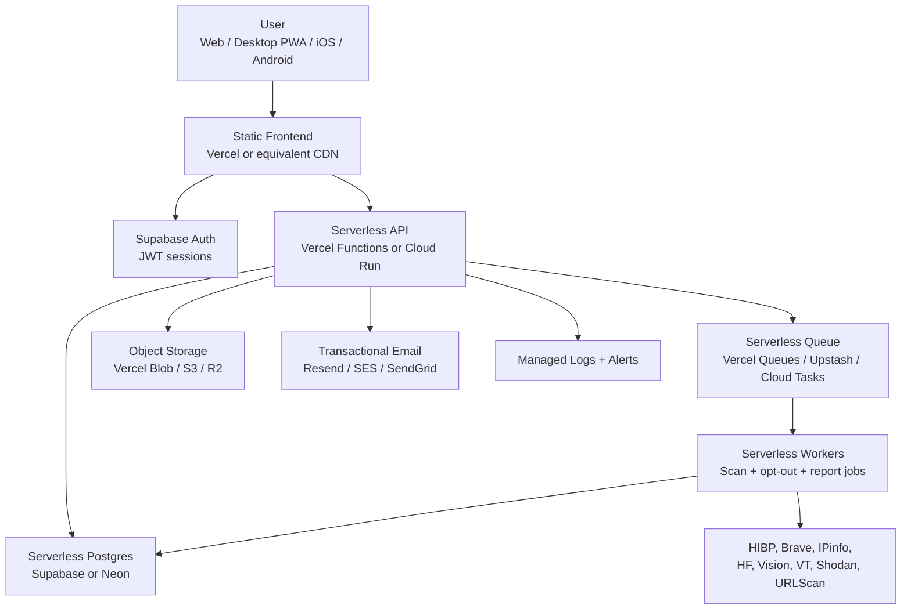

# Vindica Serverless Migration Plan

Updated: 2026-07-25

## Short Answer

Yes, Vindica can become effectively serverless.

The practical target is:

> **No VPS, no Docker Compose host, no manually managed Postgres/Redis/worker machine, and no nginx server to babysit.**

The app will still have backend logic, jobs, databases, queues, and provider integrations, but those pieces should run on managed serverless services.

## Recommended Target Architecture

## What Changes

| Current Piece | Serverless Replacement | Notes |
|---|---|---|
| Hetzner VPS | Vercel / Cloud Run / managed platform | Removes SSH/nginx/Docker host failures. |
| nginx | Platform routing | `/api` routing handled by deployment config. |
| Vite static frontend | Vercel static deployment | Already easy to serve as static app/PWA. |
| FastAPI container | Serverless API functions or Cloud Run service | Cloud Run is easiest if keeping Python/FastAPI. |
| Docker Postgres | Supabase Postgres or Neon | Managed backups, pooling, SSL. |
| Redis container | Upstash Redis or Vercel-managed Redis equivalent | Rate limits, cache, queue state. |
| Celery workers | Queues + serverless workers | Needs redesign of scan execution lifecycle. |
| Local report files | Blob/S3/R2 object storage | Needed for PDFs, evidence, screenshots. |
| Manual server env | Platform env vars/secrets | Keys stay server-only. |
| Server cron/beat | Platform cron | Scheduled monitoring scans. |

## Best Migration Path

There are two viable paths.

## Path A: Lowest Rewrite, Serverless Containers

Use this if the priority is to get off the VPS fast while keeping the existing Python/FastAPI backend.

### Stack

- Frontend: Vercel static app
- Backend: Google Cloud Run or AWS App Runner
- Database: Supabase Postgres or Neon
- Redis: Upstash Redis
- Queue: Cloud Tasks / Pub/Sub / Upstash QStash
- Files: S3 / Cloudflare R2 / Vercel Blob
- Auth: Supabase
- Email: Resend, SendGrid, or SES

### Pros

- Keeps most FastAPI code.
- Better for Python dependencies and Playwright-style tasks.
- Easier than rewriting everything to Next.js API routes.
- No long-lived VPS or nginx.

### Cons

- Not “pure function-per-route” serverless.
- Still deploys containers, but they are managed and autoscaled.
- Need cloud IAM and service config.

### Recommendation

This is the safest near-term path for Vindica because the backend is already Python/FastAPI and has workers.

## Path B: Full Vercel Serverless Rewrite

Use this if the priority is one platform, tight frontend/backend integration, and a future Next.js SaaS architecture.

### Stack

- Frontend: Next.js or existing Vite static app on Vercel
- API: Vercel Functions
- Queue: Vercel Queues / Workflow
- Database: Neon or Supabase Postgres
- Redis/rate limits: Upstash
- Files: Vercel Blob
- Auth: Supabase or Clerk
- Email: Resend

### Pros

- Clean serverless SaaS shape.
- Great deploy ergonomics.
- Managed logs, env vars, previews, rollbacks.
- Easy PWA/static frontend hosting.

### Cons

- Requires more rewrite.
- Current FastAPI routes must be ported or wrapped.
- Long-running scan jobs need careful queue/workflow design.
- Python-specific provider logic may need to move to Node or isolated worker services.

### Recommendation

Good long-term architecture, but not the fastest route to stable production.

## Recommended Decision

For Vindica, choose a hybrid serverless architecture:

1. **Frontend on Vercel**
2. **Auth on Supabase**
3. **Database on Supabase Postgres or Neon**
4. **Redis/rate limits on Upstash**
5. **Backend on Cloud Run first**
6. **Async jobs on Cloud Tasks/Pub/Sub or QStash**
7. **Reports/evidence files in object storage**

This gets rid of the fragile VPS while preserving most backend work.

Later, individual endpoints can move to Vercel Functions where it makes sense.

## Migration Phases

## Phase 1: Serverless Readiness Cleanup

Goal: make the app deployable without relying on local Docker host assumptions.

### Tasks

- Remove assumptions that `postgres` and `redis` hostnames exist outside Docker.
- Require env-driven `DATABASE_URL`, `SYNC_DATABASE_URL`, and `REDIS_URL`.
- Confirm backend can run against external Postgres/Redis.
- Ensure report artifacts write to object storage, not local disk.
- Make `/ready` expose all missing platform dependencies.
- Keep provider keys server-only.

### Done When

- Backend starts locally against managed Postgres/Redis.
- `/ready` shows database and queue connected.
- No source code depends on `/var/www/vindica`.

## Phase 2: Managed Data Layer

Goal: move data and cache off the VPS.

### Database

Recommended choices:

- Supabase Postgres if you want auth and database in the same ecosystem.
- Neon if you want Vercel-native serverless Postgres ergonomics.

### Redis

Recommended:

- Upstash Redis for rate limits, cached provider lookups, and lightweight state.

### Tasks

- Create managed Postgres.
- Run Alembic migrations.
- Create managed Redis.
- Update env vars.
- Run backend tests against managed URLs.

### Done When

- A scan can be created and loaded without local Docker Postgres.
- Rate limits work without local Docker Redis.

## Phase 3: Frontend Serverless Hosting

Goal: remove nginx/static hosting from the VPS.

### Tasks

- Deploy `frontend/` as a static app.
- Set:
  - `VITE_API_BASE_URL`
  - `VITE_SUPABASE_URL`
  - `VITE_SUPABASE_PUBLISHABLE_KEY`
- Verify:
  - `/`
  - `/lookup`
  - `/osint`
  - `/dashboard`
  - `/account`
  - `/privacy`
  - `/terms`
  - `/manifest.webmanifest`
  - `/sw.js`

### Done When

- Desktop PWA install works over HTTPS.
- Mobile browser install works.
- The frontend no longer depends on a VPS.

## Phase 4: Backend Serverless Hosting

Goal: move FastAPI off the VPS.

### Cloud Run Path

- Package existing `backend/` Dockerfile.
- Deploy as autoscaled service.
- Set env vars in cloud secret manager/platform env.
- Allow only HTTPS ingress.
- Point frontend `VITE_API_BASE_URL` to the Cloud Run API URL or custom API domain.

### Vercel Functions Path

- Port each FastAPI route into serverless route handlers.
- Replace SQLAlchemy runtime assumptions with serverless-friendly database client/pooling.
- Use queue/workflow APIs for async scans.

### Done When

- `/health` and `/ready` pass on the managed backend.
- Frontend scan request reaches the managed backend.
- No inbound traffic depends on Hetzner.

## Phase 5: Queue And Scan Workers

Goal: replace Celery workers and Redis broker with serverless jobs.

### Current Behavior

- API creates scan.
- Celery queues worker.
- Worker calls providers.
- Worker updates progress/results in Postgres.

### Serverless Behavior

- API creates scan.
- API publishes `scan.requested` queue event.
- Worker function consumes event.
- Worker updates progress/results.
- Failed provider calls are stored as partial provider statuses.
- Retries are per scan/provider step, not whole-system restarts.

### Required Events

- `scan.requested`
- `scan.provider.completed`
- `scan.completed`
- `scan.failed`
- `optout.requested`
- `report.requested`
- `monitoring.rescan.requested`

### Done When

- API returns queued scan immediately.
- Worker finishes scan without a long-running VPS process.
- Queue retry is visible in managed dashboard.

## Phase 6: File And Report Storage

Goal: make evidence exports durable without local disk.

### Tasks

- Store report PDFs/JSON in private object storage.
- Store manual evidence uploads in private object storage.
- Return expiring download URLs.
- Delete files when user deletes vault data.

### Done When

- Report generation works after deploy.
- Files survive redeploys.
- User deletion removes linked files.

## Phase 7: Production Security And Cost Controls

Goal: make serverless safe instead of accidentally expensive.

### Required Controls

- Per-user scan limits.
- Per-IP anonymous limits.
- Provider call dedupe/cache.
- Max request body size.
- Max remote image size.
- Private-network URL blocking.
- Provider timeouts.
- Monthly provider budgets.
- Queue concurrency limits.
- Auth-required production mode.
- User ownership tests.

### Done When

- One user cannot read another user’s data.
- API keys cannot be seen in frontend bundle.
- High-cost endpoints fail closed when limits are exceeded.

## Phase 8: Domain Cutover

Goal: make `vindica.me` point to the serverless stack.

### Tasks

- Move DNS from VPS IP to frontend platform.
- Configure `api.vindica.me` or `/api` proxy to backend.
- Verify SSL.
- Run smoke tests.
- Keep old VPS offline or locked down after migration.

### Done When

- `https://vindica.me` loads from serverless frontend.
- `https://vindica.me/ready` or `https://api.vindica.me/ready` passes.
- No user traffic reaches the Hetzner VPS.

## Minimal Serverless MVP

The first serverless cut should not try to migrate everything.

Build this first:

1. Frontend on Vercel/static hosting.
2. Supabase Auth.
3. Supabase/Neon Postgres.
4. FastAPI on Cloud Run.
5. Upstash Redis.
6. No Celery at first: use `RUN_SCANS_INLINE=true` only for short provider calls.
7. Move long jobs to queue in the next phase.

This gives a stable live product quickly.

## What Not To Do

- Do not paste provider keys into frontend env vars.
- Do not rely on browser-side calls to HIBP, Brave, Shodan, VirusTotal, or paid APIs.
- Do not run long scan jobs inside a short function timeout without queue/retry design.
- Do not use local filesystem for user evidence/reports.
- Do not promise fully live broker deletion before verified broker contacts and email delivery are ready.
- Do not migrate everything and redesign the UI in the same release.

## Decision Matrix

| Question | Recommendation |
|---|---|
| Fastest stable live app? | Vercel frontend + Cloud Run FastAPI + managed Postgres/Redis. |
| Most elegant long-term Vercel app? | Next.js + Vercel Functions + Queues + Neon/Upstash. |
| Least rewrite? | Cloud Run backend. |
| Best for mobile parity? | Keep same API contract and point mobile to serverless API. |
| Best for heavy scans? | Queue-backed workers, not synchronous API routes. |
| Best for cost control? | Redis/Upstash quotas + cached provider calls + queue concurrency caps. |

## Recommended Next Commit

Add a serverless profile without deleting Docker:

- `docs/VINDICA_SERVERLESS_MIGRATION_PLAN.md`
- `frontend/.env.serverless.example`
- `backend/.env.serverless.example`
- `scripts/serverless-smoke-test.sh`
- Backend config notes for external Postgres/Redis.

This lets Vindica migrate deliberately while preserving the working Docker/VPS path until the serverless path passes smoke tests.

